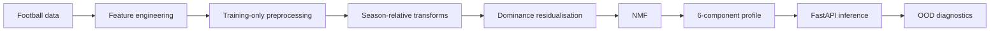

# Tactical Style ML Service

[](https://github.com/wiggin944/tactical-style-ml-service/actions/workflows/ci.yml)


Production-style ML service for representing football teams as continuous tactical profiles.

This repository productionises the tactical-style stage of a larger MSc Computer Science football modelling project. The research pipeline was refactored into explicit preprocessing, persisted model state, cohort inference, monitoring, FastAPI endpoints, automated tests, Docker and CI.

> The original research database and fitted dissertation model are not included. The public repository generates a deterministic synthetic demo artefact so the engineering stack can be run without exposing research data or fitted parameters.

## What this demonstrates

- research-to-production ML engineering
- reproducible preprocessing and persisted model state
- typed FastAPI inference with input validation
- automated testing, Docker packaging and GitHub Actions CI
- operational OOD/distribution diagnostics
- separation of public demo assets from private research data and fitted parameters

## Model

The final model represents each team with six continuous Non-negative Matrix Factorisation (NMF) components rather than assigning a single tactical cluster.

It uses 29 engineered features covering passing and progression, territorial occupation, pressing, carries, penalty-area presence, chance creation, defensive actions, recoveries, aerial performance, xG, deep progression, set-piece reliance and transition threat. Territory and pressing compositions use log-ratio coordinates.

Research split:
- Train: 2021-22, 2022-23, 2023-24
- Held-out: 2024-25
- Features: 29
- NMF components: 6
- Random seed: 7



## Cohort inference

Percentile ranks and standardisation are season-relative, so single-team inference is not meaningful. The API therefore accepts a cohort and rejects single-team requests. For real use, the cohort should represent the relevant season as completely as possible.

The persisted artefact stores model state, feature ordering, training-only imputation values, residualisation coefficients, residual support, feature-distribution references and metadata.

## Monitoring

Inference reports lightweight operational diagnostics:
- values outside the training 1st-99th percentile range
- shifted feature count
- maximum mean shift in training standard deviations
- residual inputs clipped to non-negative NMF support

These are OOD warnings, not formal proof of statistical drift.

## API

Run locally:

```bash
uvicorn src.api.main:app --host 127.0.0.1 --port 8000
```

Endpoints:

| Endpoint | Purpose |
|---|---|
| `GET /health` | Service/model health |
| `GET /model` | Model and feature contract |
| `POST /predict/cohort` | Tactical-profile inference |

Validation includes minimum cohort size, a 500-row maximum, duplicate-key rejection, unknown-field rejection and non-finite numeric rejection. Interactive docs are available at `/docs`.

## Synthetic public demo

Generate the demo artefact:

```bash
python -m scripts.create_demo_artifact
```

The synthetic artefact matches the API contract but contains no original observations or fitted dissertation parameters.

## Tests

```bash
python -m scripts.create_demo_artifact
python -m pytest -v
```

The public suite covers API health, model contract, cohort inference, invalid inputs, oversized requests, temporal leakage protection, artefact structure and OOD monitoring. The private development version additionally includes exact regression checks against the frozen Stage 1 research output and held-out real-data inference.

## Docker

```bash
docker build -t tactical-style-api .
docker run --rm -p 127.0.0.1:8000:8000 tactical-style-api
```

The Docker build generates its own synthetic demo model. Research data and local fitted artefacts are excluded from the build context.

## CI

GitHub Actions installs pinned dependencies, compiles production modules, generates the synthetic artefact, runs tests and independently verifies the Docker build.

## Repository structure

```text
.github/workflows/ci.yml
scripts/create_demo_artifact.py
src/api/
src/tactical_model/
tests/
Dockerfile
requirements.txt
README.md
```

`data/` and generated `artifacts/` are ignored by Git.

## Productionisation

The work includes modular data/feature/preprocessing/model/inference code, temporal leakage guards, persisted preprocessing state, schema validation, cohort-aware inference, OOD diagnostics, typed FastAPI models, automated tests, Docker, CI and separation of private research assets from the public repository.

## Limitations

The six dimensions are latent NMF components, not manually defined tactical labels. Predictions are cohort-relative because preprocessing contains within-season transforms. The synthetic public model demonstrates the software contract only and should not be interpreted as meaningful football analysis.

The service is not publicly deployed. Authentication and rate limiting would be required before internet-facing deployment.

## Research provenance

This service originates from the tactical representation stage of an MSc Computer Science dissertation on context-aware football modelling.

## Licence

No open-source licence is granted. Source code is publicly visible for portfolio and evaluation purposes. All rights reserved.
